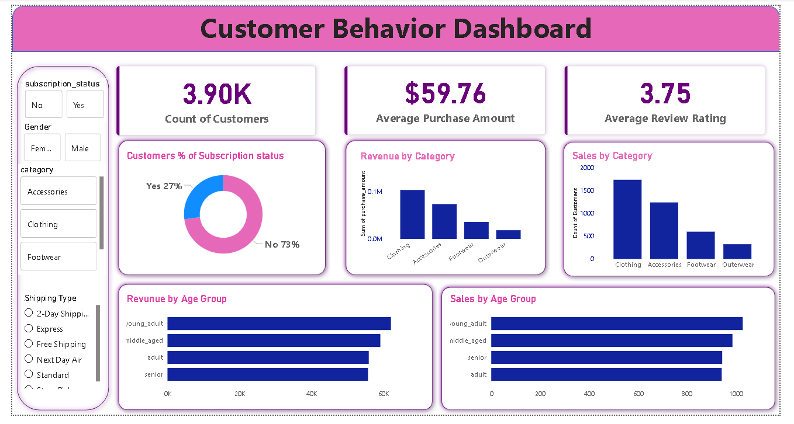

# Retail Customer Behavior Analytics

## Project Overview

This is an End-to-End Data Analytics Project developed using SQL, Python, and Power BI to analyze customer shopping behavior and generate business insights.

The project demonstrates the complete analytics workflow followed in real organizations, including data collection, data cleaning, exploratory data analysis, business analysis, dashboard development, and reporting.

---

## Business Problem Statement

Retail companies generate large volumes of customer transaction data every day. However, identifying customer purchasing patterns, product performance, and revenue opportunities from raw data can be challenging.

The objective of this project is to analyze customer shopping behavior and provide actionable insights that help businesses improve customer engagement, optimize sales strategies, and make data-driven decisions.

---

## Tools & Technologies Used

* SQL (PostgreSQL)
* Python
* Pandas
* Power BI
* Excel

---

## Project Workflow

### 1. Data Collection

Collected customer shopping behavior dataset for analysis.

### 2. Data Cleaning

* Handling missing values
* Removing duplicates
* Data validation
* Data transformation

### 3. Exploratory Data Analysis (EDA)

* Customer behavior analysis
* Product performance analysis
* Purchase trend analysis
* Revenue analysis

### 4. SQL Business Analysis

Solved business questions using SQL queries and generated meaningful insights.

### 5. Dashboard Development

Built an interactive Power BI dashboard for business stakeholders to monitor KPIs and customer trends.

---

## Repository Contents

* Customer Shopping Dataset (.csv)
* SQL Queries (.sql)
* Python Analysis Notebook (.ipynb)
* Power BI Dashboard (.pbix)
* Dashboard Screenshot (.png)
* Business Problem Statement
* Project Presentation (.pptx)

---

## Key Insights

* Clothing category generated the highest revenue.
* Young adult customers contributed the highest sales volume.
* Non-subscribed customers represented the majority of customers.
* Average purchase amount was approximately $59.76.
* Customer shopping behavior varied significantly across categories and demographics.

---

## Dashboard Preview

---

## Author

**G Avinash**

Data Engineer | Data Analyst | Business Intelligence Analyst

GitHub: https://github.com/avinash-dataengineer

LinkedIn: [www.linkedin.com/in/avinashgurramkonda-data-analyst](http://www.linkedin.com/in/avinashgurramkonda-data-Engineer)
